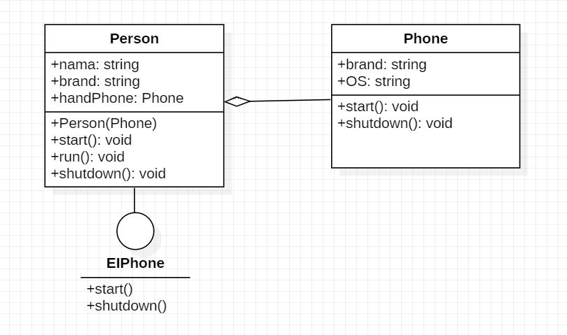
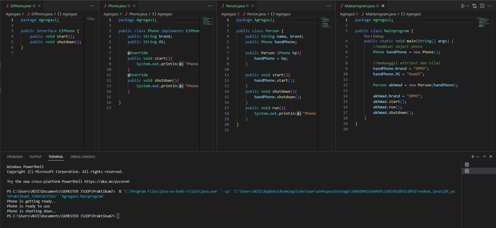
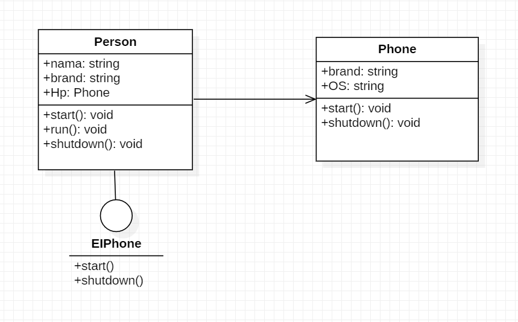
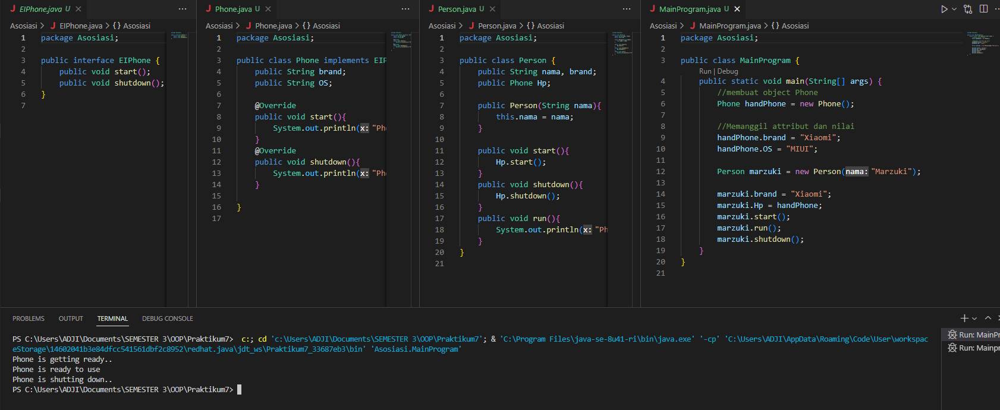
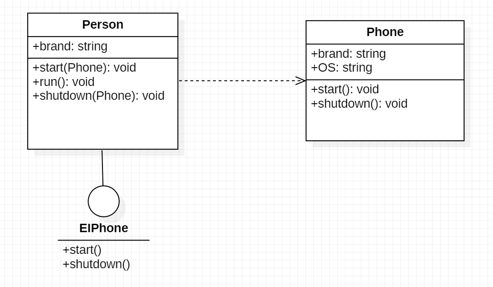
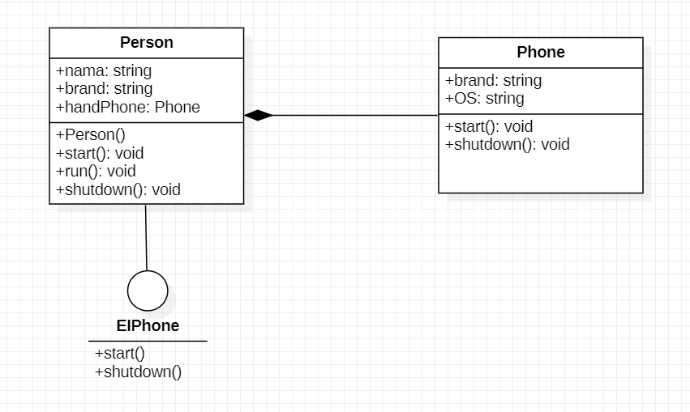
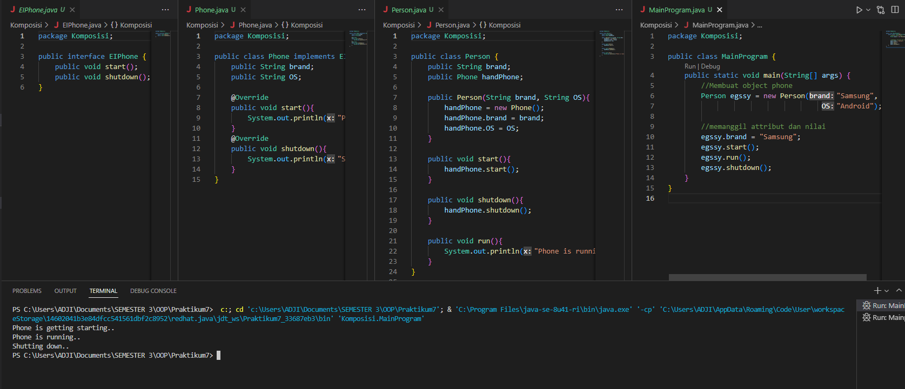

# Praktikum7  
## Diagram UML Agregasi  
  
## Output program Agregasi  
  
## Diagram UML Asosiasi  
  
## Output program Asosiasi  
  
## Diagram UML Dependesi  
  
## Output program Dependesi  
  
## Diagram UML Komposisi  
  
## Output program Komposisi  
  
