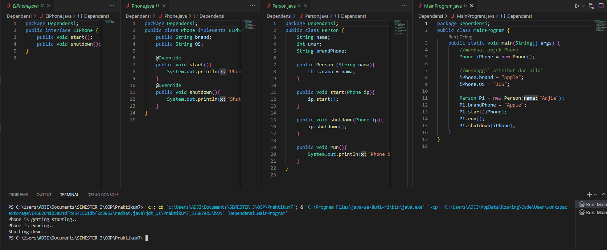

# Praktikum7  
Diagram UML Agregasi  
Output program Agregasi  
  
Diagram UML Asosiasi  
Output program Asosiasi  
  
Diagram UML Dependesi  
Output program Dependesi  
  
Diagram UML Komposisi  
Output program Komposisi  
  
